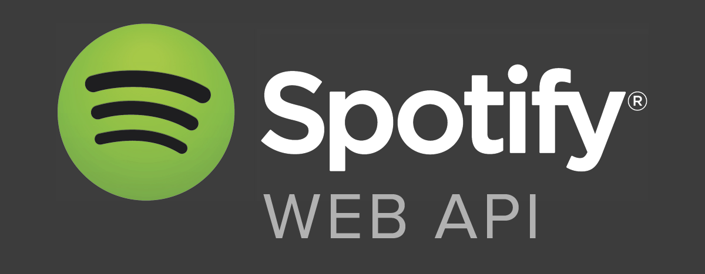

# Spotify-js-web-api

[](https://npmjs.org/package/generator-nod)
[](https://travis-ci.org/diegohaz/nod) [](https://codecov.io/gh/diegohaz/nod/branch/master)

Async+Await / ES6 JavaScript bindings for Spotify.

---



---

## Install

```sh
$ npm install --save spotify-js-web-api
```

```js
import { browse, follow, playlists, search, setSpotifyToken } from "spotify-js-web-api"
```

### Retrieving and Setting Access Token

Retrieve your Spotify Developer `OAuth Token`. You can generate a `temporary token` with [Spotify's-API-console](https://developer.spotify.com/console/get-album-tracks/)

When your app `first` `loads`, use this `function` to `set` your `auth` token.

```js
const token = "BQBrnKyWwLDnsbrnw9J3xnCSR-1jlyXhtFrgVm5dWnWlWoaqj1bx0ZqAlarYSO4QSQgCBjt60ynmrT27n5RJdyfJNkdwNwTyXnIQNLjvhIxVdhk1sUiHjaqGzHe4tST7dijYu1Z3FyZVv_uzIcqPn_sY-p7kPXTHMatFOpVONtUr6Sc3kEZva1Nmy58B8jVVlQVOWZ0efwnne3TenIbZ2bcfHpmvm6j-B-NCb_kB32UgyMHMlsAxMssYIq8SY5SGwaRfmFZFlpTBOhrZWw";
Spotify.setSpotifyToken(token);
```

You will receive a `JSON` `error` `object` with a `401` `unauthorized` message back from Spotify if your `temporary` `key` `expires` or you `do` `not` `set` `one` prior to running your API call.

---

## API

#### Table of Contents

---

### **Playlists API**

---

1. [Get All Categories](#Get-All-Categories)

---

### **Browse API**

---

1. [Get All Categories](#Get-All-Categories)
2. [Get Single Category](#Get-Single-Category)
3. [Get Category Playlists](#Get-Category-Playlists)
4. [Get Reccomendations Based on Seeds](#Get-Reccomendations-Based-on-Seeds)
5. [Get Reccomendation Genres](#Get-Reccomendation-Genres)
6. [Get Available Genre Seeds](#Get-Available-Genre-Seeds)
7. [Get All New Releases](#Get-All-New-Releases)
8. [Get All Featured Playlists](#Get-All-Featured-Playlists)

---

### **Follow API**

---

1. [Get Following State for Artists/Users](#Get-Following-State-for-Artists/Users)
2. [Check if Users Follow a Playlist](#Check-if-Users-Follow-a-Playlist)
3. [Follow Artists or Users](#Follow-Artists-or-Users)
4. [Get User's Followed Artists](#Get-User's-Followed-Artists)
5. [Unfollow Artists or Users](#Unfollow-Artists–or–Users)
6. [Unfollow Playlist](#Unfollow-Playlist)

----

### **Search API**

---

1. [Search for an Item](#Search-for-an-Item)

----

### **Personalization API**

---

1. [Get a User's Top Artists and Tracks](#Get-a-User's-Top-Artists-and-Tracks)

----


## Instructions

### About Query Arguments

When creating your query data, the main `arguments` are `required` parameters, `optional` are optional query parameters. 

Functions that do `not` have `required` parameters can be executed `without` `arguments`.

---

### **Playlists API**

---
#### Add Tracks to a Playlist

Add one or more tracks to a user’s playlist.

>  The position to insert the tracks, a zero-based index. If position is omitted, the tracks will be appended to the playlist. 

Tracks are added in the order they are listed in the query string or request body.

```js
const playlistId = "3cEYpjA9oz9GiPac4AsH4n";
const optional = {
  uris: "spotify:track:4iV5W9uYEdYUVa79Axb7Rh,spotify:track:1301WleyT98MSxVHPZCA6M",
  position: 2
};
const snapshot = playlists.addTracksToPlaylist(playlistId, optional);
```
##### Response

<details><summary>json</summary>
<p>

```json
{"snapshot_id":"JbtmHBDBAYu3/bt8BOXKjzKx3i0b6LCa/wVjyl6qQ2Yf6nFXkbmzuEa+ZI/U1yF+"}
```

</p>
</details>

A `snapshot_id` in `JSON` format. The `snapshot_id` can be used to identify your playlist version in future requests.

> [API Docs](https://developer.spotify.com/documentation/web-api/reference-beta/#endpoint-add-tracks-to-playlist)

> [Top](#Table-of-Contents)
---

### **Browse API**

---
#### Get All Categories

Get a list of categories used to tag items in Spotify (on, for example, the Spotify player’s “Browse” tab).

```js
const optional = {
  country: "MX",
  locale: "es_MX",
  limit: 10,
  offset: 100
};
const allCategories = await browse.getAllCategories(optional);
```

##### Response

<details><summary>json</summary>
<p>

```json
{
  "categories" : {
    "href" : "https://api.spotify.com/v1/browse/categories?offset=0&limit=20",
    "items" : [ {
      "href" : "https://api.spotify.com/v1/browse/categories/toplists",
      "icons" : [ {
        "height" : 275,
        "url" : "https://datsnxq1rwndn.cloudfront.net/media/derived/toplists_11160599e6a04ac5d6f2757f5511778f_0_0_275_275.jpg",
        "width" : 275
      } ],
      "id" : "toplists",
      "name" : "Top Lists"
    }, {
      "href" : "https://api.spotify.com/v1/browse/categories/mood",
      "icons" : [ {
        "height" : 274,
        "url" : "https://datsnxq1rwndn.cloudfront.net/media/original/mood-274x274_976986a31ac8c49794cbdc7246fd5ad7_274x274.jpg",
        "width" : 274
      } ],
      "id" : "mood",
      "name" : "Mood"
    }, {
      "href" : "https://api.spotify.com/v1/browse/categories/party",
      "icons" : [ {
        "height" : 274,
        "url" : "https://datsnxq1rwndn.cloudfront.net/media/derived/party-274x274_73d1907a7371c3bb96a288390a96ee27_0_0_274_274.jpg",
        "width" : 274
      } ],
      "id" : "party",
      "name" : "Party"
    }, {
      "href" : "https://api.spotify.com/v1/browse/categories/pop",
      "icons" : [ {
        "height" : 274,
        "url" : "https://datsnxq1rwndn.cloudfront.net/media/derived/pop-274x274_447148649685019f5e2a03a39e78ba52_0_0_274_274.jpg",
        "width" : 274
      } ],
      "id" : "pop",
      "name" : "Pop"
    }, {
      "href" : "https://api.spotify.com/v1/browse/categories/workout",
      "icons" : [ {
        "height" : 275,
        "url" : "https://datsnxq1rwndn.cloudfront.net/media/derived/workout_856581c1c545a5305e49a3cd8be804a0_0_0_275_275.jpg",
        "width" : 275
      } ],
      "id" : "workout",
      "name" : "Workout"
    }, ... ],
    "limit" : 20,
    "next" : "https://api.spotify.com/v1/browse/categories?offset=20&limit=20",
    "offset" : 0,
    "previous" : null,
    "total" : 31
  }
}
```

</p>
</details>

`JSON Object` with a `categories field` and an `array` of `category objects` (wrapped in a `paging object`).

> [API Docs](https://developer.spotify.com/documentation/web-api/reference-beta/#endpoint-get-categories)

> [Top](#Table-of-Contents)
---

#### Get Single Category

Get a single category used to tag items in Spotify (on, for example, the Spotify player’s “Browse” tab).

```js
const categoryId = "dinner";
const optional = {
  country: "SE",
  locale: "sv_SE"
};
const aSingleBrowseCategory = await browse.getSingleBrowseCategory(
  categoryId,
  optional
);
```

##### Response

<details><summary>json</summary>
<p>

```json
{
  "href" : "https://api.spotify.com/v1/browse/categories/party",
  "icons" : [ {
    "height" : 274,
    "url" : "https://datsnxq1rwndn.cloudfront.net/media/derived/party-274x274_73d1907a7371c3bb96a288390a96ee27_0_0_274_274.jpg",
    "width" : 274
  } ],
  "id" : "party",
  "name" : "Party"
}
```

</p>
</details>

A `category object` in `JSON` format.

> [API Docs](https://developer.spotify.com/documentation/web-api/reference-beta/#endpoint-get-a-category)

> [Top](#Table-of-Contents)
---

#### Get Category Playlists

Get a list of Spotify playlists tagged with a particular category.

```js
const categoryId = "metal";

const categoryPlaylists = await browse.getCategoryPlaylists(categoryId, optional);
```

##### Response

<details><summary>json</summary>
<p>

```json
{
  "playlists" : {
    "href" : "https://api.spotify.com/v1/browse/categories/party/playlists?country=BR&offset=0&limit=2",
    "items" : [ {
      "collaborative" : false,
      "external_urls" : {
        "spotify" : "http://open.spotify.com/user/spotifybrazilian/playlist/4k7EZPI3uKMz4aRRrLVfen"
      },
      "href" : "https://api.spotify.com/v1/users/spotifybrazilian/playlists/4k7EZPI3uKMz4aRRrLVfen",
      "id" : "4k7EZPI3uKMz4aRRrLVfen",
      "images" : [ {
        "height" : 300,
        "url" : "https://i.scdn.co/image/bf6544c213532e9650088dfef76c8521093d970e",
        "width" : 300
      } ],
      "name" : "Noite Eletrônica",
      "owner" : {
        "external_urls" : {
          "spotify" : "http://open.spotify.com/user/spotifybrazilian"
        },
        "href" : "https://api.spotify.com/v1/users/spotifybrazilian",
        "id" : "spotifybrazilian",
        "type" : "user",
        "uri" : "spotify:user:spotifybrazilian"
      },
      "public" : null,
      "snapshot_id" : "PULvu1V2Ps8lzCxNXfNZTw4QbhBpaV0ZORc03Mw6oj6kQw9Ks2REwhL5Xcw/74wL",
      "tracks" : {
        "href" : "https://api.spotify.com/v1/users/spotifybrazilian/playlists/4k7EZPI3uKMz4aRRrLVfen/tracks",
        "total" : 100
      },
      "type" : "playlist",
      "uri" : "spotify:user:spotifybrazilian:playlist:4k7EZPI3uKMz4aRRrLVfen"
    }, {
      "collaborative" : false,
      "external_urls" : {
        "spotify" : "http://open.spotify.com/user/spotifybrazilian/playlist/4HZh0C9y80GzHDbHZyX770"
      },
      "href" : "https://api.spotify.com/v1/users/spotifybrazilian/playlists/4HZh0C9y80GzHDbHZyX770",
      "id" : "4HZh0C9y80GzHDbHZyX770",
      "images" : [ {
        "height" : 300,
        "url" : "https://i.scdn.co/image/be6c333146674440123073cb32c1c8b851e69023",
        "width" : 300
      } ],
      "name" : "Festa Indie",
      "owner" : {
        "external_urls" : {
          "spotify" : "http://open.spotify.com/user/spotifybrazilian"
        },
        "href" : "https://api.spotify.com/v1/users/spotifybrazilian",
        "id" : "spotifybrazilian",
        "type" : "user",
        "uri" : "spotify:user:spotifybrazilian"
      },
      "public" : null,
      "snapshot_id" : "V66hh9k2HnLCdzHvtoXPv+tm0jp3ODM63SZ0oISfGnlHQxwG/scupDbKgIo99Zfz",
      "tracks" : {
        "href" : "https://api.spotify.com/v1/users/spotifybrazilian/playlists/4HZh0C9y80GzHDbHZyX770/tracks",
        "total" : 74
      },
      "type" : "playlist",
      "uri" : "spotify:user:spotifybrazilian:playlist:4HZh0C9y80GzHDbHZyX770"
    } ],
    "limit" : 2,
    "next" : "https://api.spotify.com/v1/browse/categories/party/playlists?country=BR&offset=2&limit=2",
    "offset" : 0,
    "previous" : null,
    "total" : 86
  }
}
```

</p>
</details>

An `array` of simplified `playlist objects` (wrapped in a `paging object`) in `JSON` format.

> [API Docs](https://developer.spotify.com/documentation/web-api/reference-beta/#endpoint-get-a-categories-playlists)

> [Top](#Table-of-Contents)
---

#### Get Reccomendations Based on Seeds

Recommendations are generated based on the available information for a given seed entity and matched against similar artists and tracks. If there is sufficient information about the provided seeds, a list of tracks will be returned together with pool size details.

For artists and tracks that are very new or obscure there might not be enough data to generate a list of tracks.

```js
const seedArtists = "4NHQUGzhtTLFvgF5SZesLK";
const seedGenres = "classical,country";
const seedTracks = "0c6xIDDpzE81m2q797ordA";
const optional = {
  limit: 10,
  market: "ES",
  minAcousticness: 0,
  maxAcousticness: 1,
  targetAcousticness: 0.00000242,
  minDanceability: 0,
  maxDanceability: 1,
  targetDanceability: 0.245,
  minDurationMs: 0,
  maxDurationMs: 516107,
  targetDurationMs: 216107,
  minEnergy: 0,
  maxEnergy: 1,
  targetEnergy: 0.981,
  minInstrumentalness: 0,
  maxInstrumentalness: 1,
  targetInstrumentalness: 0.936,
  minKey: 1,
  maxKey: 9,
  targetKey: 7,
  minLiveness: 0,
  maxLiveness: 1,
  targetLiveness: 0.222,
  minLoudness: -60,
  maxLoudness: 60,
  targetLoudness: -7.555,
  minMode: 0,
  maxMode: 1,
  targetMode: 1,
  minPopularity: 1,
  maxPopularity: 100,
  targetPopularity: 51,
  minSpeechiness: 0,
  maxSpeechiness: 1,
  targetSpeechiness: 0.17,
  minTempo: 100,
  maxTempo: 160,
  targetTempo: 114.378,
  minTimeSignature: 3,
  maxTimeSignature: 13,
  targetTimeSignature: 3,
  minValence: 0,
  maxValence: 1,
  targetValence: 0.309
};
const reccomendations = await browse.getReccomendations(
  seedArtists,
  seedGenres,
  seedTracks,
  optional
);
```

##### Response

<details><summary>json</summary>
<p>

```json
{
  "tracks": [
    {
      "artists" : [ {
        "external_urls" : {
          "spotify" : "https://open.spotify.com/artist/134GdR5tUtxJrf8cpsfpyY"
        },
          "href" : "https://api.spotify.com/v1/artists/134GdR5tUtxJrf8cpsfpyY",
          "id" : "134GdR5tUtxJrf8cpsfpyY",
          "name" : "Elliphant",
          "type" : "artist",
          "uri" : "spotify:artist:134GdR5tUtxJrf8cpsfpyY"
      }, {
        "external_urls" : {
          "spotify" : "https://open.spotify.com/artist/1D2oK3cJRq97OXDzu77BFR"
        },
          "href" : "https://api.spotify.com/v1/artists/1D2oK3cJRq97OXDzu77BFR",
          "id" : "1D2oK3cJRq97OXDzu77BFR",
          "name" : "Ras Fraser Jr.",
          "type" : "artist",
          "uri" : "spotify:artist:1D2oK3cJRq97OXDzu77BFR"
      } ],
      "disc_number" : 1,
      "duration_ms" : 199133,
      "explicit" : false,
      "external_urls" : {
        "spotify" : "https://open.spotify.com/track/1TKYPzH66GwsqyJFKFkBHQ"
      },
      "href" : "https://api.spotify.com/v1/tracks/1TKYPzH66GwsqyJFKFkBHQ",
      "id" : "1TKYPzH66GwsqyJFKFkBHQ",
      "is_playable" : true,
      "name" : "Music Is Life",
      "preview_url" : "https://p.scdn.co/mp3-preview/546099103387186dfe16743a33edd77e52cec738",
      "track_number" : 1,
      "type" : "track",
      "uri" : "spotify:track:1TKYPzH66GwsqyJFKFkBHQ"
    }, {
      "artists" : [ {
        "external_urls" : {
          "spotify" : "https://open.spotify.com/artist/1VBflYyxBhnDc9uVib98rw"
        },
          "href" : "https://api.spotify.com/v1/artists/1VBflYyxBhnDc9uVib98rw",
          "id" : "1VBflYyxBhnDc9uVib98rw",
          "name" : "Icona Pop",
          "type" : "artist",
          "uri" : "spotify:artist:1VBflYyxBhnDc9uVib98rw"
      } ],
        "disc_number" : 1,
        "duration_ms" : 187026,
        "explicit" : false,
        "external_urls" : {
          "spotify" : "https://open.spotify.com/track/15iosIuxC3C53BgsM5Uggs"
        },
        "href" : "https://api.spotify.com/v1/tracks/15iosIuxC3C53BgsM5Uggs",
        "id" : "15iosIuxC3C53BgsM5Uggs",
        "is_playable" : true,
        "name" : "All Night",
        "preview_url" : "https://p.scdn.co/mp3-preview/9ee589fa7fe4e96bad3483c20b3405fb59776424",
        "track_number" : 2,
        "type" : "track",
        "uri" : "spotify:track:15iosIuxC3C53BgsM5Uggs"
    },
    ...
  ],
  "seeds": [
    {
      "initialPoolSize": 500,
      "afterFilteringSize": 380,
      "afterRelinkingSize": 365,
      "href": "https://api.spotify.com/v1/artists/4NHQUGzhtTLFvgF5SZesLK",
      "id": "4NHQUGzhtTLFvgF5SZesLK",
      "type": "artist"
    }, {
      "initialPoolSize": 250,
      "afterFilteringSize": 172,
      "afterRelinkingSize": 144,
      "href": "https://api.spotify.com/v1/tracks/0c6xIDDpzE81m2q797ordA",
      "id": "0c6xIDDpzE81m2q797ordA",
      "type": "track"
    }
  ]
}
```

</p>
</details>

A `recommendations` response `object` in `JSON` format.

> [API Docs](https://developer.spotify.com/documentation/web-api/reference-beta/#endpoint-get-recommendations)

> [Top](#Table-of-Contents)
---

#### Get Reccomendation Genres

Retrieve a list of available genres seed parameter values for recommendations.

```js
const optional = {
  country: "US",
  limit: 10,
  offset: 5
};
const reccomendationGenres = await browse.getReccomendationGenres(optional);
```

##### Response

A `recommendations` response `object` in `JSON` format.

<details><summary>json</summary>
<p>

```json
{
    "genres": [
      "alt_rock",
      "bluegrass",
      "blues",
      "classical",
      "country",
      "dance",
      "electro",
      "hard_rock",
      "heavy_metal",
      "hip_hop",
      "house",
       .....
       .....
       ..... ]
}
```

</p>
</details>

> [API Docs](https://developer.spotify.com/documentation/web-api/reference-beta/#endpoint-get-recommendation-genres)

> [Top](#Table-of-Contents)
---

#### Get All New Releases

Get a list of new album releases featured in Spotify (shown, for example, on a Spotify player’s “Browse” tab).

```js
const allNewReleases = await getAllNewReleases();
```

##### Response

<details><summary>json</summary>
<p>

```json
{
  "albums" : {
    "href" : "https://api.spotify.com/v1/browse/new-releases?country=SE&offset=0&limit=20",
    "items" : [ {
      "album_type" : "single",
      "artists" : [ {
        "external_urls" : {
          "spotify" : "https://open.spotify.com/artist/2RdwBSPQiwcmiDo9kixcl8"
        },
        "href" : "https://api.spotify.com/v1/artists/2RdwBSPQiwcmiDo9kixcl8",
        "id" : "2RdwBSPQiwcmiDo9kixcl8",
        "name" : "Pharrell Williams",
        "type" : "artist",
        "uri" : "spotify:artist:2RdwBSPQiwcmiDo9kixcl8"
      } ],
      "available_markets" : [ "AD", "AR", "AT", "AU", "BE", "BG", "BO", "BR", "CA", "CH", "CL", "CO", "CR", "CY", "CZ", "DE", "DK", "DO", "EC", "EE", "ES", "FI", "FR", "GB", "GR", "GT", "HK", "HN", "HU", "ID", "IE", "IS", "IT", "JP", "LI", "LT", "LU", "LV", "MC", "MT", "MX", "MY", "NI", "NL", "NO", "NZ", "PA", "PE", "PH", "PL", "PT", "PY", "SE", "SG", "SK", "SV", "TR", "TW", "US", "UY" ],
      "external_urls" : {
        "spotify" : "https://open.spotify.com/album/5ZX4m5aVSmWQ5iHAPQpT71"
      },
      "href" : "https://api.spotify.com/v1/albums/5ZX4m5aVSmWQ5iHAPQpT71",
      "id" : "5ZX4m5aVSmWQ5iHAPQpT71",
      "images" : [ {
        "height" : 640,
        "url" : "https://i.scdn.co/image/e6b635ebe3ef4ba22492f5698a7b5d417f78b88a",
        "width" : 640
      }, {
        "height" : 300,
        "url" : "https://i.scdn.co/image/92ae5b0fe64870c09004dd2e745a4fb1bf7de39d",
        "width" : 300
      }, {
        "height" : 64,
        "url" : "https://i.scdn.co/image/8a7ab6fc2c9f678308ba0f694ecd5718dc6bc930",
        "width" : 64
      } ],
      "name" : "Runnin'",
      "type" : "album",
      "uri" : "spotify:album:5ZX4m5aVSmWQ5iHAPQpT71"
    }, {
      "album_type" : "single",
      "artists" : [ {
        "external_urls" : {
          "spotify" : "https://open.spotify.com/artist/3TVXtAsR1Inumwj472S9r4"
        },
        "href" : "https://api.spotify.com/v1/artists/3TVXtAsR1Inumwj472S9r4",
        "id" : "3TVXtAsR1Inumwj472S9r4",
        "name" : "Drake",
        "type" : "artist",
        "uri" : "spotify:artist:3TVXtAsR1Inumwj472S9r4"
      } ],
      "available_markets" : [ "AD", "AR", "AT", "AU", "BE", "BG", "BO", "BR", "CH", "CL", "CO", "CR", "CY", "CZ", "DE", "DK", "DO", "EC", "EE", "ES", "FI", "FR", "GB", "GR", "GT", "HK", "HN", "HU", "ID", "IE", "IS", "IT", "JP", "LI", "LT", "LU", "LV", "MC", "MT", "MY", "NI", "NL", "NO", "NZ", "PA", "PE", "PH", "PL", "PT", "PY", "SE", "SG", "SK", "SV", "TR", "TW", "UY" ],
      "external_urls" : {
        "spotify" : "https://open.spotify.com/album/0geTzdk2InlqIoB16fW9Nd"
      },
      "href" : "https://api.spotify.com/v1/albums/0geTzdk2InlqIoB16fW9Nd",
      "id" : "0geTzdk2InlqIoB16fW9Nd",
      "images" : [ {
        "height" : 640,
        "url" : "https://i.scdn.co/image/d40e9c3d22bde2fbdb2ecc03cccd7a0e77f42e4c",
        "width" : 640
      }, {
        "height" : 300,
        "url" : "https://i.scdn.co/image/dff06a3375f6d9b32ecb081eb9a60bbafecb5731",
        "width" : 300
      }, {
        "height" : 64,
        "url" : "https://i.scdn.co/image/808a02bd7fc59b0652c9df9f68675edbffe07a79",
        "width" : 64
      } ],
      "name" : "Sneakin’",
      "type" : "album",
      "uri" : "spotify:album:0geTzdk2InlqIoB16fW9Nd"
    }, {
    ...
    } ],
    "limit" : 20,
    "next" : "https://api.spotify.com/v1/browse/new-releases?country=SE&offset=20&limit=20",
    "offset" : 0,
    "previous" : null,
    "total" : 500
  }
}
```

</p>
</details>

A `message` and an `albums object`. The `albums object` contains an `array` of simplified `album objects` (wrapped in a `paging object`) in `JSON` format.

> [API Docs](https://developer.spotify.com/documentation/web-api/reference-beta/#endpoint-get-new-releases)

> [Top](#Table-of-Contents)
---

#### Get All Featured Playlists

Get a list of Spotify featured playlists (shown, for example, on a Spotify player’s ‘Browse’ tab).

```js
const allFeaturedPlaylists = await getAllFeaturedPlaylists();
```

##### Response

<details><summary>json</summary>
<p>

```json
{
  "message" : "Monday morning music, coming right up!",
  "playlists" : {
    "href" : "https://api.spotify.com/v1/browse/featured-playlists?country=SE&timestamp=2015-05-18T06:44:32&offset=0&limit=2",
    "items" : [ {
      "collaborative" : false,
      "external_urls" : {
        "spotify" : "http://open.spotify.com/user/spotify/playlist/6ftJBzU2LLQcaKefMi7ee7"
      },
      "href" : "https://api.spotify.com/v1/users/spotify/playlists/6ftJBzU2LLQcaKefMi7ee7",
      "id" : "6ftJBzU2LLQcaKefMi7ee7",
      "images" : [ {
        "height" : 300,
        "url" : "https://i.scdn.co/image/7bd33c65ebd1e45975bbcbbf513bafe272f033c7",
        "width" : 300
      } ],
      "name" : "Monday Morning Mood",
      "owner" : {
        "external_urls" : {
          "spotify" : "http://open.spotify.com/user/spotify"
        },
        "href" : "https://api.spotify.com/v1/users/spotify",
        "id" : "spotify",
        "type" : "user",
        "uri" : "spotify:user:spotify"
      },
      "public" : null,
      "snapshot_id" : "WwGvSIVUkUvGvqjgj/bQHlRycYmJ2TkoIxYfoalWlmIZT6TvsgvGMgtQ2dGbkrAW",
      "tracks" : {
        "href" : "https://api.spotify.com/v1/users/spotify/playlists/6ftJBzU2LLQcaKefMi7ee7/tracks",
        "total" : 245
      },
      "type" : "playlist",
      "uri" : "spotify:user:spotify:playlist:6ftJBzU2LLQcaKefMi7ee7"
    }, {
      "collaborative" : false,
      "external_urls" : {
        "spotify" : "http://open.spotify.com/user/spotify__sverige/playlist/4uOEx4OUrkoGNZoIlWMUbO"
      },
      "href" : "https://api.spotify.com/v1/users/spotify__sverige/playlists/4uOEx4OUrkoGNZoIlWMUbO",
      "id" : "4uOEx4OUrkoGNZoIlWMUbO",
      "images" : [ {
        "height" : 300,
        "url" : "https://i.scdn.co/image/24aa1d1b491dd529b9c03392f350740ed73438d8",
        "width" : 300
      } ],
      "name" : "Upp och hoppa!",
      "owner" : {
        "external_urls" : {
          "spotify" : "http://open.spotify.com/user/spotify__sverige"
        },
        "href" : "https://api.spotify.com/v1/users/spotify__sverige",
        "id" : "spotify__sverige",
        "type" : "user",
        "uri" : "spotify:user:spotify__sverige"
      },
      "public" : null,
      "snapshot_id" : "0j9Rcbt2KtCXEXKtKy/tnSL5r4byjDBOIVY1dn4S6GV73EEUgNuK2hU+QyDuNnXz",
      "tracks" : {
        "href" : "https://api.spotify.com/v1/users/spotify__sverige/playlists/4uOEx4OUrkoGNZoIlWMUbO/tracks",
        "total" : 38
      },
      "type" : "playlist",
      "uri" : "spotify:user:spotify__sverige:playlist:4uOEx4OUrkoGNZoIlWMUbO"
    } ],
    "limit" : 2,
    "next" : "https://api.spotify.com/v1/browse/featured-playlists?country=SE&timestamp=2015-05-18T06:44:32&offset=2&limit=2",
    "offset" : 0,
    "previous" : null,
    "total" : 12
  }
}
```

</p>
</details>

The `playlists object` contains an `array` of simplified `playlist objects` (wrapped in a `paging object`) in `JSON` format.

>[API Docs](https://developer.spotify.com/documentation/web-api/reference-beta/#endpoint-get-featured-playlists)

> [Top](#Table-of-Contents)
---

### **Follow API**

---
#### Get Following State for Artists/Users

Check to see if the current user is following one or more artists or other Spotify users.

```js
const type = "artist";
const ids =
  "5U827e4jbYz6EjtN0fIDt9,2CIMQHirSU0MQqyYHq0eOx,1s4OwCgHh16FZOkmmNLWeO";
const response = await follow.getFollowingStateForArtistsUsers(
  type,
  ids
);
```
##### Response

<details><summary>json</summary>
<p>

```json
[ true ]
```

</p>
</details>

Aa `JSON array` of true or false values, in the `same` `order` in which the `ids` were specified.

> [API Docs](https://developer.spotify.com/documentation/web-api/reference-beta/#endpoint-check-current-user-follows)

> [Top](#Table-of-Contents)
---

#### Check if Users Follow a Playlist

Check to see if one or more Spotify users are following a specified playlist.

```js
const playlistId = "3cEYpjA9oz9GiPac4AsH4n";
const ids = "jmperezperez,thelinmichael,wizzler";
const response = await follow.checkIfUsersFollowPlaylist(
  playlistId,
  ids
);
```
##### Response

<details><summary>json</summary>
<p>

```json
[ true, false ]
```

</p>
</details>

Aa `JSON array` of true or false values, in the `same` `order` in which the `ids` were specified.

> [API Docs](https://developer.spotify.com/documentation/web-api/reference-beta/#endpoint-check-if-user-follows-playlist)

> [Top](#Table-of-Contents)
---
#### Follow Artists or Users

Add the current user as a follower of one or more artists or other Spotify users.

```js
const type = "artist";
const ids = "0AMoPrd9OLxMC38dQPnSQA,02umg9eoz6lshS5GVJ5KE0";
const { status } = await follow.followArtistsOrUsers(type, ids);
```
##### Response

<details><summary>json</summary>
<p>

```json
HTTP/1.1 204 No Content
```

</p>
</details>

The `HTTP` `status` `code` in the response header is `204` `No` `Content` and the response body is empty.

> [API Docs](https://developer.spotify.com/documentation/web-api/reference-beta/#endpoint-follow-artists-users)

> [Top](#Table-of-Contents)
---
#### Follow a Playlist

Add the current user as a follower of a playlist.

```js
const playlistId = "2v3iNvBX8Ay1Gt2uXtUKUT";
const body = { public: false };
const { status } = await follow.followPlaylist(playlistId, body);
```
##### Response

<details><summary>json</summary>
<p>

```json
HTTP/1.1 200 OK
```

</p>
</details>

The `HTTP` `status` `code` in the response header is `200` `OK` and the response body is empty.

> [API Docs](https://developer.spotify.com/documentation/web-api/reference-beta/#endpoint-follow-playlist)

> [Top](#Table-of-Contents)
---
#### Get User's Followed Artists

Get the current user’s followed artists.

```js
const type = "artist";
const optional = {
  after: "0I2XqVXqHScXjHhk6AYYRe",
  limit: 10
}
const followedArtists = await follow.getUserFollowedArtists(type, optional);
```
##### Response

<details><summary>json</summary>
<p>

```json
{
  "artists" : {
    "items" : [ {
      "external_urls" : {
        "spotify" : "https://open.spotify.com/artist/0I2XqVXqHScXjHhk6AYYRe"
      },
      "followers" : {
        "href" : null,
        "total" : 7753
      },
      "genres" : [ "swedish hip hop" ],
      "href" : "https://api.spotify.com/v1/artists/0I2XqVXqHScXjHhk6AYYRe",
      "id" : "0I2XqVXqHScXjHhk6AYYRe",
      "images" : [ {
        "height" : 640,
        "url" : "https://i.scdn.co/image/2c8c0cea05bf3d3c070b7498d8d0b957c4cdec20",
        "width" : 640
      }, {
        "height" : 300,
        "url" : "https://i.scdn.co/image/394302b42c4b894786943e028cdd46d7baaa29b7",
        "width" : 300
      }, {
        "height" : 64,
        "url" : "https://i.scdn.co/image/ca9df7225ade6e5dfc62e7076709ca3409a7cbbf",
        "width" : 64
      } ],
      "name" : "Afasi & Filthy",
      "popularity" : 54,
      "type" : "artist",
      "uri" : "spotify:artist:0I2XqVXqHScXjHhk6AYYRe"
  },{
    ...
  }],
  "next" : "https://api.spotify.com/v1/users/thelinmichael/following?type=artist&after=0aV6DOiouImYTqrR5YlIqx&limit=20",
  "total" : 183,
    "cursors" : {
      "after" : "0aV6DOiouImYTqrR5YlIqx"
    },
  "limit" : 20,
  "href" : "https://api.spotify.com/v1/users/thelinmichael/following?type=artist&limit=20"
  }
}
```

</p>
</details>

The `HTTP status code` in the response header is `200 OK` and the response `body` contains an `artists object`. 
The `artists object` in turn contains a `cursor-based paging object` of `Artists`. 

> [API Docs](https://developer.spotify.com/documentation/web-api/reference-beta/#endpoint-get-followed)

> [Top](#Table-of-Contents)
---
#### Unfollow Artists or Users

Remove the current user as a follower of one or more artists or other Spotify users.

```js
const type = "artist";
const ids = "2CIMQHirSU0MQqyYHq0eOx,57dN52uHvrHOxijzpIgu3E,1vCWHaC5f2uS3yhpwWbIA6";
const { status } = await follow.unfollowArtistsOrUsers(type, ids);
```
##### Response

<details><summary>json</summary>
<p>

```json
HTTP/1.1 204 No Content
```

</p>
</details>

The `HTTP` `status` `code` in the response header is `204` `No` `Content` and the response body is empty.

> [API Docs](https://developer.spotify.com/documentation/web-api/reference-beta/#endpoint-unfollow-artists-users)

> [Top](#Table-of-Contents)
---
#### Unfollow Playlist

Remove the current user as a follower of a playlist.

```js
const playlistId = "3SnvUaB6Z9aaCZ2P6PEJvy";
const { status } = await follow.unfollowPlaylist(playlistId);
```
##### Response

<details><summary>json</summary>
<p>

```json
HTTP/1.1 200 OK
```

</p>
</details>

The `HTTP` `status` `code` in the response header is `200` `OK` and the response body is empty.

> [API Docs](https://developer.spotify.com/documentation/web-api/reference-beta/#endpoint-unfollow-playlist)

> [Top](#Table-of-Contents)

---

### **Search API**

---
#### Search for an Item

Get Spotify Catalog information about artists, albums, tracks or playlists that match a keyword string.

```js
const query = "Muse";
const type = "track,artist";
const optional = {
  market: "US",
  limit: 10,
  offset: 5
};
const response = await search.searchForItem(
  query,
  type,
  optional
);
```
##### Response

<details><summary>json</summary>
<p>

```json
{
  "artists": {
    "href": "https://api.spotify.com/v1/search?query=tania+bowra\u0026offset=0\u0026limit=20\u0026type=artist",
    "items": [
      {
        "external_urls": {
          "spotify": "https://open.spotify.com/artist/08td7MxkoHQkXnWAYD8d6Q"
        },
        "genres": [],
        "href": "https://api.spotify.com/v1/artists/08td7MxkoHQkXnWAYD8d6Q",
        "id": "08td7MxkoHQkXnWAYD8d6Q",
        "images": [
          {
            "height": 640,
            "url": "https://i.scdn.co/image/f2798ddab0c7b76dc2d270b65c4f67ddef7f6718",
            "width": 640
          },
          {
            "height": 300,
            "url": "https://i.scdn.co/image/b414091165ea0f4172089c2fc67bb35aa37cfc55",
            "width": 300
          },
          {
            "height": 64,
            "url": "https://i.scdn.co/image/8522fc78be4bf4e83fea8e67bb742e7d3dfe21b4",
            "width": 64
          }
        ],
        "name": "Tania Bowra",
        "popularity": 0,
        "type": "artist",
        "uri": "spotify:artist:08td7MxkoHQkXnWAYD8d6Q"
      }
    ],
    "limit": 20,
    "next": null,
    "offset": 0,
    "previous": null,
    "total": 1
  }
}
```

</p>
</details>

In the response header the `HTTP status code` is `200 OK`.

The response `body` contains an `array` of `artist objects`, simplified `album objects`, and/or `track objects` wrapped in a `paging object` in `JSON`.

> [API Docs](https://developer.spotify.com/documentation/web-api/reference-beta/#endpoint-search)

> [Top](#Table-of-Contents)

---

### **Personalization API**

---
#### Get a User's Top Artists and Tracks

Get the current user’s top artists or tracks based on calculated affinity.

```js
const type = "tracks"
const optional = {
  limit: 10,
  offset: 5,
  timeRange: "long_term" // short_term - medium_term
};
const response = await personalization.getUserTopArtistsAndTracks(type, optional);
```
##### Response

<details><summary>json</summary>
<p>

```json
{
  "items" : [ {
    "external_urls" : {
      "spotify" : "https://open.spotify.com/artist/0I2XqVXqHScXjHhk6AYYRe"
    },
    "followers" : {
      "href" : null,
      "total" : 7753
    },
    "genres" : [ "swedish hip hop" ],
    "href" : "https://api.spotify.com/v1/artists/0I2XqVXqHScXjHhk6AYYRe",
    "id" : "0I2XqVXqHScXjHhk6AYYRe",
    "images" : [ {
      "height" : 640,
      "url" : "https://i.scdn.co/image/2c8c0cea05bf3d3c070b7498d8d0b957c4cdec20",
      "width" : 640
    }, {
      "height" : 300,
      "url" : "https://i.scdn.co/image/394302b42c4b894786943e028cdd46d7baaa29b7",
      "width" : 300
    }, {
      "height" : 64,
      "url" : "https://i.scdn.co/image/ca9df7225ade6e5dfc62e7076709ca3409a7cbbf",
      "width" : 64
    } ],
    "name" : "Afasi & Filthy",
    "popularity" : 54,
    "type" : "artist",
    "uri" : "spotify:artist:0I2XqVXqHScXjHhk6AYYRe"
  },{
  ...
  }],
  "next" : "https://api.spotify.com/v1/me/top/artists?offset=20",
  "previous" : null,
  "total" : 50,
  "limit" : 20,
  "href" : "https://api.spotify.com/v1/me/top/artists"
}
```

</p>
</details>

In the response header the `HTTP status code` is `200 OK`.

The response `body` contains an `array` of `artist` or `track` objects `wrapped` in a `paging object` in `JSON`.

> [API Docs](https://developer.spotify.com/documentation/web-api/reference-beta/#endpoint-get-users-top-artists-and-tracks)

> [Top](#Table-of-Contents)

---

## License

MIT © David Mieloch